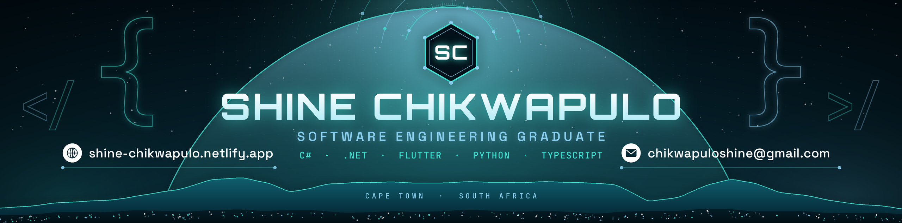

<!--Banner-->

<!--Owl image-->

  

<!--Header Name-->
# ɪ'ᴍ sʜɪɴᴇ! 👋🏽
*Software Engineering Graduate (BSc IT) · Cape Town, South Africa*
 

<!--Start Intro-->

I'm a software engineering graduate who builds full-stack web and mobile apps, mostly with C#/.NET, Python, Flutter and TypeScript. I like turning a real-world problem into something that works end to end: data model, API, UI, tests and deployment.

- 🎓 BSc IT in Software Engineering, graduating 2 November 2026
- 🔭 Looking for **graduate and junior software engineering roles** in South Africa
- 🧱 Recent work: booking and restaurant sites in **.NET 10 + Blazor**, and a **Flutter + Firebase + FastAPI** capstone I led with a team of four
- 🌱 Next on my list: CI/CD with GitHub Actions, deploying a .NET app to Azure, and PostgreSQL
- 💼 Connect on [LinkedIn](https://www.linkedin.com/in/shine-chikwapulo-741b20265/) · 🌐 [Portfolio](https://shine-chikwapulo.netlify.app)
<!--End Intro-->

<!--Profile Count Badge-->

  

---

<!--Languages and Tools Section-->
<h2 align="center">Tᴇᴄʜ sᴛᴀᴄᴋ</h2>

<h3 align="left">Currently learning</h3>
<ul align="left">
  <li>Automating builds and tests with GitHub Actions.</li>
  <li>Deploying .NET applications to Azure.</li>
  <li>PostgreSQL and production-grade database migrations.</li>
</ul>

<h2 align="center">Sᴇʟᴇᴄᴛᴇᴅ ᴘʀᴏᴊᴇᴄᴛs</h2>

| Project | What it is | Tech |
|---|---|---|
| [Inkrepublik](https://github.com/ShyneChikwapulo/inkrepublik) | Booking site and admin panel for a tattoo studio ([demo](https://inkrepublik.onrender.com/)) | .NET 10, Blazor, EF Core, Docker |
| [ML Advisor](https://github.com/ShyneChikwapulo/ml-advisor) | Capstone app for choosing ML models for bug prediction; I led the team of four ([API](https://ml-advisor-api.onrender.com)) | Flutter, Firebase, FastAPI |
| [The Butcher's Mermaid](https://github.com/ShyneChikwapulo/butchers-mermaid) | Restaurant and butchery website with 31 xUnit tests ([demo](https://butchers-mermaid.onrender.com/)) | .NET 10, Blazor, EF Core |
| [African Nations League](https://github.com/ShyneChikwapulo/CAF-African-Nations-League) | Tournament simulator with AI-written commentary | React, TypeScript, Express, Firebase |

 

<!--Github stats Table-->
<h2 align="center">📊 Gɪᴛʜᴜʙ sᴛᴀᴛs 📊</h2>

<table width="100%">
  <tr>
    <td width="50%">
      <h3 align="center"><strong>Gɪᴛʜᴜʙ sᴛᴀᴛs</strong></h3>
      

        
      

    </td>
    <td width="50%">
      <h3 align="center"><strong>Sᴛʀᴇᴀᴋ sᴛᴀᴛs</strong></h3>
      

        
      

    </td>
  </tr>
  <tr>
    <td width="50%">
      <h3 align="center"><strong>Fᴇᴀᴛᴜʀᴇᴅ: Tʜᴇ Bᴜᴛᴄʜᴇʀ's Mᴇʀᴍᴀɪᴅ</strong></h3>
      

        
      

    </td>
    <td width="50%">
      <h3 align="center"><strong>Fᴇᴀᴛᴜʀᴇᴅ: Mʟ Aᴅᴠɪsᴏʀ</strong></h3>
      

        
      

    </td>
  </tr>
</table>
 

<!--Contribution Graph-->
<h2 align="center">📈 Cᴏɴᴛʀɪʙᴜᴛɪᴏɴ ɢʀᴀᴘʜ 📈</h2>

    

---

<!--Dynamic Quote card updates every day at 12 PM South African time-->
<h2 align="center">🌟 Tʜᴏᴜɢʜᴛ ᴏғ ᴛʜᴇ ᴅᴀʏ 🌟</h2>

<!--STARTS_HERE_QUOTE_CARD-->

    

<!--ENDS_HERE_QUOTE_CARD-->

<!--Contact Section-->

<h2 align="center">🤝 Cᴏɴɴᴇᴄᴛ ᴡɪᴛʜ ᴍᴇ 🤝</h2>

 

<!--Footer-->

  

